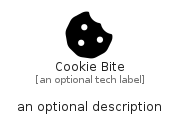

# CookieBite


```text
fontawesome/Solid/CookieBite
```

```text
include('fontawesome/Solid/CookieBite')
```


| Illustration | CookieBite |
| :---: | :---: |
|  |  |


## Sprites
The item provides the following sriptes:

- `<$CookieBiteXs>`
- `<$CookieBiteSm>`
- `<$CookieBiteMd>`
- `<$CookieBiteLg>`


## CookieBite

### Load remotely
```plantuml
@startuml
' configures the library
!global $LIB_BASE_LOCATION="https://raw.githubusercontent.com/tmorin/plantuml-libs/master/distribution"

' loads the library's bootstrap
!include $LIB_BASE_LOCATION/bootstrap.puml

' loads the package bootstrap
include('fontawesome/bootstrap')

' loads the Item which embeds the element CookieBite
include('fontawesome/Solid/CookieBite')

' renders the element
CookieBite('CookieBite', 'Cookie Bite', 'an optional tech label', 'an optional description')
@enduml
```

### Load locally
```plantuml
@startuml
' configures the library
!global $INCLUSION_MODE="local"
!global $LIB_BASE_LOCATION="../.."

' loads the library's bootstrap
!include $LIB_BASE_LOCATION/bootstrap.puml

' loads the package bootstrap
include('fontawesome/bootstrap')

' loads the Item which embeds the element CookieBite
include('fontawesome/Solid/CookieBite')

' renders the element
CookieBite('CookieBite', 'Cookie Bite', 'an optional tech label', 'an optional description')
@enduml
```

