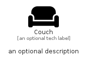

# Couch


```text
fontawesome/Solid/Couch
```

```text
include('fontawesome/Solid/Couch')
```


| Illustration | Couch |
| :---: | :---: |
|  |  |


## Sprites
The item provides the following sriptes:

- `<$CouchXs>`
- `<$CouchSm>`
- `<$CouchMd>`
- `<$CouchLg>`


## Couch

### Load remotely
```plantuml
@startuml
' configures the library
!global $LIB_BASE_LOCATION="https://raw.githubusercontent.com/tmorin/plantuml-libs/master/distribution"

' loads the library's bootstrap
!include $LIB_BASE_LOCATION/bootstrap.puml

' loads the package bootstrap
include('fontawesome/bootstrap')

' loads the Item which embeds the element Couch
include('fontawesome/Solid/Couch')

' renders the element
Couch('Couch', 'Couch', 'an optional tech label', 'an optional description')
@enduml
```

### Load locally
```plantuml
@startuml
' configures the library
!global $INCLUSION_MODE="local"
!global $LIB_BASE_LOCATION="../.."

' loads the library's bootstrap
!include $LIB_BASE_LOCATION/bootstrap.puml

' loads the package bootstrap
include('fontawesome/bootstrap')

' loads the Item which embeds the element Couch
include('fontawesome/Solid/Couch')

' renders the element
Couch('Couch', 'Couch', 'an optional tech label', 'an optional description')
@enduml
```

