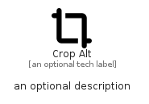

# CropAlt


```text
fontawesome/Solid/CropAlt
```

```text
include('fontawesome/Solid/CropAlt')
```


| Illustration | CropAlt |
| :---: | :---: |
|  |  |


## Sprites
The item provides the following sriptes:

- `<$CropAltXs>`
- `<$CropAltSm>`
- `<$CropAltMd>`
- `<$CropAltLg>`


## CropAlt

### Load remotely
```plantuml
@startuml
' configures the library
!global $LIB_BASE_LOCATION="https://raw.githubusercontent.com/tmorin/plantuml-libs/master/distribution"

' loads the library's bootstrap
!include $LIB_BASE_LOCATION/bootstrap.puml

' loads the package bootstrap
include('fontawesome/bootstrap')

' loads the Item which embeds the element CropAlt
include('fontawesome/Solid/CropAlt')

' renders the element
CropAlt('CropAlt', 'Crop Alt', 'an optional tech label', 'an optional description')
@enduml
```

### Load locally
```plantuml
@startuml
' configures the library
!global $INCLUSION_MODE="local"
!global $LIB_BASE_LOCATION="../.."

' loads the library's bootstrap
!include $LIB_BASE_LOCATION/bootstrap.puml

' loads the package bootstrap
include('fontawesome/bootstrap')

' loads the Item which embeds the element CropAlt
include('fontawesome/Solid/CropAlt')

' renders the element
CropAlt('CropAlt', 'Crop Alt', 'an optional tech label', 'an optional description')
@enduml
```

