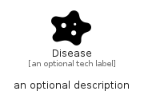

# Disease


```text
fontawesome/Solid/Disease
```

```text
include('fontawesome/Solid/Disease')
```


| Illustration | Disease |
| :---: | :---: |
|  |  |


## Sprites
The item provides the following sriptes:

- `<$DiseaseXs>`
- `<$DiseaseSm>`
- `<$DiseaseMd>`
- `<$DiseaseLg>`


## Disease

### Load remotely
```plantuml
@startuml
' configures the library
!global $LIB_BASE_LOCATION="https://raw.githubusercontent.com/tmorin/plantuml-libs/master/distribution"

' loads the library's bootstrap
!include $LIB_BASE_LOCATION/bootstrap.puml

' loads the package bootstrap
include('fontawesome/bootstrap')

' loads the Item which embeds the element Disease
include('fontawesome/Solid/Disease')

' renders the element
Disease('Disease', 'Disease', 'an optional tech label', 'an optional description')
@enduml
```

### Load locally
```plantuml
@startuml
' configures the library
!global $INCLUSION_MODE="local"
!global $LIB_BASE_LOCATION="../.."

' loads the library's bootstrap
!include $LIB_BASE_LOCATION/bootstrap.puml

' loads the package bootstrap
include('fontawesome/bootstrap')

' loads the Item which embeds the element Disease
include('fontawesome/Solid/Disease')

' renders the element
Disease('Disease', 'Disease', 'an optional tech label', 'an optional description')
@enduml
```

