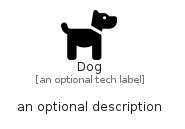

# Dog


```text
fontawesome/Solid/Dog
```

```text
include('fontawesome/Solid/Dog')
```


| Illustration | Dog |
| :---: | :---: |
|  |  |


## Sprites
The item provides the following sriptes:

- `<$DogXs>`
- `<$DogSm>`
- `<$DogMd>`
- `<$DogLg>`


## Dog

### Load remotely
```plantuml
@startuml
' configures the library
!global $LIB_BASE_LOCATION="https://raw.githubusercontent.com/tmorin/plantuml-libs/master/distribution"

' loads the library's bootstrap
!include $LIB_BASE_LOCATION/bootstrap.puml

' loads the package bootstrap
include('fontawesome/bootstrap')

' loads the Item which embeds the element Dog
include('fontawesome/Solid/Dog')

' renders the element
Dog('Dog', 'Dog', 'an optional tech label', 'an optional description')
@enduml
```

### Load locally
```plantuml
@startuml
' configures the library
!global $INCLUSION_MODE="local"
!global $LIB_BASE_LOCATION="../.."

' loads the library's bootstrap
!include $LIB_BASE_LOCATION/bootstrap.puml

' loads the package bootstrap
include('fontawesome/bootstrap')

' loads the Item which embeds the element Dog
include('fontawesome/Solid/Dog')

' renders the element
Dog('Dog', 'Dog', 'an optional tech label', 'an optional description')
@enduml
```

