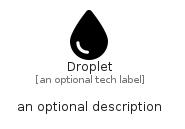

# Droplet


```text
fontawesome/Solid/Droplet
```

```text
include('fontawesome/Solid/Droplet')
```


| Illustration | Droplet |
| :---: | :---: |
|  |  |


## Sprites
The item provides the following sriptes:

- `<$DropletXs>`
- `<$DropletSm>`
- `<$DropletMd>`
- `<$DropletLg>`


## Droplet

### Load remotely
```plantuml
@startuml
' configures the library
!global $LIB_BASE_LOCATION="https://raw.githubusercontent.com/tmorin/plantuml-libs/master/distribution"

' loads the library's bootstrap
!include $LIB_BASE_LOCATION/bootstrap.puml

' loads the package bootstrap
include('fontawesome/bootstrap')

' loads the Item which embeds the element Droplet
include('fontawesome/Solid/Droplet')

' renders the element
Droplet('Droplet', 'Droplet', 'an optional tech label', 'an optional description')
@enduml
```

### Load locally
```plantuml
@startuml
' configures the library
!global $INCLUSION_MODE="local"
!global $LIB_BASE_LOCATION="../.."

' loads the library's bootstrap
!include $LIB_BASE_LOCATION/bootstrap.puml

' loads the package bootstrap
include('fontawesome/bootstrap')

' loads the Item which embeds the element Droplet
include('fontawesome/Solid/Droplet')

' renders the element
Droplet('Droplet', 'Droplet', 'an optional tech label', 'an optional description')
@enduml
```

