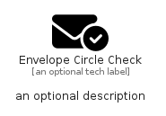

# EnvelopeCircleCheck


```text
fontawesome/Solid/EnvelopeCircleCheck
```

```text
include('fontawesome/Solid/EnvelopeCircleCheck')
```


| Illustration | EnvelopeCircleCheck |
| :---: | :---: |
|  |  |


## Sprites
The item provides the following sriptes:

- `<$EnvelopeCircleCheckXs>`
- `<$EnvelopeCircleCheckSm>`
- `<$EnvelopeCircleCheckMd>`
- `<$EnvelopeCircleCheckLg>`


## EnvelopeCircleCheck

### Load remotely
```plantuml
@startuml
' configures the library
!global $LIB_BASE_LOCATION="https://raw.githubusercontent.com/tmorin/plantuml-libs/master/distribution"

' loads the library's bootstrap
!include $LIB_BASE_LOCATION/bootstrap.puml

' loads the package bootstrap
include('fontawesome/bootstrap')

' loads the Item which embeds the element EnvelopeCircleCheck
include('fontawesome/Solid/EnvelopeCircleCheck')

' renders the element
EnvelopeCircleCheck('EnvelopeCircleCheck', 'Envelope Circle Check', 'an optional tech label', 'an optional description')
@enduml
```

### Load locally
```plantuml
@startuml
' configures the library
!global $INCLUSION_MODE="local"
!global $LIB_BASE_LOCATION="../.."

' loads the library's bootstrap
!include $LIB_BASE_LOCATION/bootstrap.puml

' loads the package bootstrap
include('fontawesome/bootstrap')

' loads the Item which embeds the element EnvelopeCircleCheck
include('fontawesome/Solid/EnvelopeCircleCheck')

' renders the element
EnvelopeCircleCheck('EnvelopeCircleCheck', 'Envelope Circle Check', 'an optional tech label', 'an optional description')
@enduml
```

