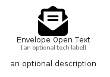

# EnvelopeOpenText


```text
fontawesome/Solid/EnvelopeOpenText
```

```text
include('fontawesome/Solid/EnvelopeOpenText')
```


| Illustration | EnvelopeOpenText |
| :---: | :---: |
|  |  |


## Sprites
The item provides the following sriptes:

- `<$EnvelopeOpenTextXs>`
- `<$EnvelopeOpenTextSm>`
- `<$EnvelopeOpenTextMd>`
- `<$EnvelopeOpenTextLg>`


## EnvelopeOpenText

### Load remotely
```plantuml
@startuml
' configures the library
!global $LIB_BASE_LOCATION="https://raw.githubusercontent.com/tmorin/plantuml-libs/master/distribution"

' loads the library's bootstrap
!include $LIB_BASE_LOCATION/bootstrap.puml

' loads the package bootstrap
include('fontawesome/bootstrap')

' loads the Item which embeds the element EnvelopeOpenText
include('fontawesome/Solid/EnvelopeOpenText')

' renders the element
EnvelopeOpenText('EnvelopeOpenText', 'Envelope Open Text', 'an optional tech label', 'an optional description')
@enduml
```

### Load locally
```plantuml
@startuml
' configures the library
!global $INCLUSION_MODE="local"
!global $LIB_BASE_LOCATION="../.."

' loads the library's bootstrap
!include $LIB_BASE_LOCATION/bootstrap.puml

' loads the package bootstrap
include('fontawesome/bootstrap')

' loads the Item which embeds the element EnvelopeOpenText
include('fontawesome/Solid/EnvelopeOpenText')

' renders the element
EnvelopeOpenText('EnvelopeOpenText', 'Envelope Open Text', 'an optional tech label', 'an optional description')
@enduml
```

