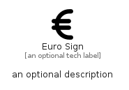

# EuroSign


```text
fontawesome/Solid/EuroSign
```

```text
include('fontawesome/Solid/EuroSign')
```


| Illustration | EuroSign |
| :---: | :---: |
|  |  |


## Sprites
The item provides the following sriptes:

- `<$EuroSignXs>`
- `<$EuroSignSm>`
- `<$EuroSignMd>`
- `<$EuroSignLg>`


## EuroSign

### Load remotely
```plantuml
@startuml
' configures the library
!global $LIB_BASE_LOCATION="https://raw.githubusercontent.com/tmorin/plantuml-libs/master/distribution"

' loads the library's bootstrap
!include $LIB_BASE_LOCATION/bootstrap.puml

' loads the package bootstrap
include('fontawesome/bootstrap')

' loads the Item which embeds the element EuroSign
include('fontawesome/Solid/EuroSign')

' renders the element
EuroSign('EuroSign', 'Euro Sign', 'an optional tech label', 'an optional description')
@enduml
```

### Load locally
```plantuml
@startuml
' configures the library
!global $INCLUSION_MODE="local"
!global $LIB_BASE_LOCATION="../.."

' loads the library's bootstrap
!include $LIB_BASE_LOCATION/bootstrap.puml

' loads the package bootstrap
include('fontawesome/bootstrap')

' loads the Item which embeds the element EuroSign
include('fontawesome/Solid/EuroSign')

' renders the element
EuroSign('EuroSign', 'Euro Sign', 'an optional tech label', 'an optional description')
@enduml
```

