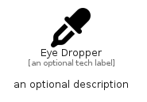

# EyeDropper


```text
fontawesome/Solid/EyeDropper
```

```text
include('fontawesome/Solid/EyeDropper')
```


| Illustration | EyeDropper |
| :---: | :---: |
|  |  |


## Sprites
The item provides the following sriptes:

- `<$EyeDropperXs>`
- `<$EyeDropperSm>`
- `<$EyeDropperMd>`
- `<$EyeDropperLg>`


## EyeDropper

### Load remotely
```plantuml
@startuml
' configures the library
!global $LIB_BASE_LOCATION="https://raw.githubusercontent.com/tmorin/plantuml-libs/master/distribution"

' loads the library's bootstrap
!include $LIB_BASE_LOCATION/bootstrap.puml

' loads the package bootstrap
include('fontawesome/bootstrap')

' loads the Item which embeds the element EyeDropper
include('fontawesome/Solid/EyeDropper')

' renders the element
EyeDropper('EyeDropper', 'Eye Dropper', 'an optional tech label', 'an optional description')
@enduml
```

### Load locally
```plantuml
@startuml
' configures the library
!global $INCLUSION_MODE="local"
!global $LIB_BASE_LOCATION="../.."

' loads the library's bootstrap
!include $LIB_BASE_LOCATION/bootstrap.puml

' loads the package bootstrap
include('fontawesome/bootstrap')

' loads the Item which embeds the element EyeDropper
include('fontawesome/Solid/EyeDropper')

' renders the element
EyeDropper('EyeDropper', 'Eye Dropper', 'an optional tech label', 'an optional description')
@enduml
```

