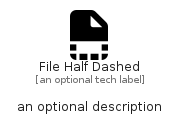

# FileHalfDashed


```text
fontawesome/Solid/FileHalfDashed
```

```text
include('fontawesome/Solid/FileHalfDashed')
```


| Illustration | FileHalfDashed |
| :---: | :---: |
|  |  |


## Sprites
The item provides the following sriptes:

- `<$FileHalfDashedXs>`
- `<$FileHalfDashedSm>`
- `<$FileHalfDashedMd>`
- `<$FileHalfDashedLg>`


## FileHalfDashed

### Load remotely
```plantuml
@startuml
' configures the library
!global $LIB_BASE_LOCATION="https://raw.githubusercontent.com/tmorin/plantuml-libs/master/distribution"

' loads the library's bootstrap
!include $LIB_BASE_LOCATION/bootstrap.puml

' loads the package bootstrap
include('fontawesome/bootstrap')

' loads the Item which embeds the element FileHalfDashed
include('fontawesome/Solid/FileHalfDashed')

' renders the element
FileHalfDashed('FileHalfDashed', 'File Half Dashed', 'an optional tech label', 'an optional description')
@enduml
```

### Load locally
```plantuml
@startuml
' configures the library
!global $INCLUSION_MODE="local"
!global $LIB_BASE_LOCATION="../.."

' loads the library's bootstrap
!include $LIB_BASE_LOCATION/bootstrap.puml

' loads the package bootstrap
include('fontawesome/bootstrap')

' loads the Item which embeds the element FileHalfDashed
include('fontawesome/Solid/FileHalfDashed')

' renders the element
FileHalfDashed('FileHalfDashed', 'File Half Dashed', 'an optional tech label', 'an optional description')
@enduml
```

