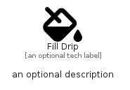

# FillDrip


```text
fontawesome/Solid/FillDrip
```

```text
include('fontawesome/Solid/FillDrip')
```


| Illustration | FillDrip |
| :---: | :---: |
|  |  |


## Sprites
The item provides the following sriptes:

- `<$FillDripXs>`
- `<$FillDripSm>`
- `<$FillDripMd>`
- `<$FillDripLg>`


## FillDrip

### Load remotely
```plantuml
@startuml
' configures the library
!global $LIB_BASE_LOCATION="https://raw.githubusercontent.com/tmorin/plantuml-libs/master/distribution"

' loads the library's bootstrap
!include $LIB_BASE_LOCATION/bootstrap.puml

' loads the package bootstrap
include('fontawesome/bootstrap')

' loads the Item which embeds the element FillDrip
include('fontawesome/Solid/FillDrip')

' renders the element
FillDrip('FillDrip', 'Fill Drip', 'an optional tech label', 'an optional description')
@enduml
```

### Load locally
```plantuml
@startuml
' configures the library
!global $INCLUSION_MODE="local"
!global $LIB_BASE_LOCATION="../.."

' loads the library's bootstrap
!include $LIB_BASE_LOCATION/bootstrap.puml

' loads the package bootstrap
include('fontawesome/bootstrap')

' loads the Item which embeds the element FillDrip
include('fontawesome/Solid/FillDrip')

' renders the element
FillDrip('FillDrip', 'Fill Drip', 'an optional tech label', 'an optional description')
@enduml
```

