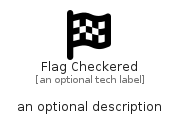

# FlagCheckered


```text
fontawesome/Solid/FlagCheckered
```

```text
include('fontawesome/Solid/FlagCheckered')
```


| Illustration | FlagCheckered |
| :---: | :---: |
|  |  |


## Sprites
The item provides the following sriptes:

- `<$FlagCheckeredXs>`
- `<$FlagCheckeredSm>`
- `<$FlagCheckeredMd>`
- `<$FlagCheckeredLg>`


## FlagCheckered

### Load remotely
```plantuml
@startuml
' configures the library
!global $LIB_BASE_LOCATION="https://raw.githubusercontent.com/tmorin/plantuml-libs/master/distribution"

' loads the library's bootstrap
!include $LIB_BASE_LOCATION/bootstrap.puml

' loads the package bootstrap
include('fontawesome/bootstrap')

' loads the Item which embeds the element FlagCheckered
include('fontawesome/Solid/FlagCheckered')

' renders the element
FlagCheckered('FlagCheckered', 'Flag Checkered', 'an optional tech label', 'an optional description')
@enduml
```

### Load locally
```plantuml
@startuml
' configures the library
!global $INCLUSION_MODE="local"
!global $LIB_BASE_LOCATION="../.."

' loads the library's bootstrap
!include $LIB_BASE_LOCATION/bootstrap.puml

' loads the package bootstrap
include('fontawesome/bootstrap')

' loads the Item which embeds the element FlagCheckered
include('fontawesome/Solid/FlagCheckered')

' renders the element
FlagCheckered('FlagCheckered', 'Flag Checkered', 'an optional tech label', 'an optional description')
@enduml
```

