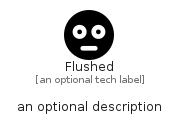

# Flushed


```text
fontawesome/Solid/Flushed
```

```text
include('fontawesome/Solid/Flushed')
```


| Illustration | Flushed |
| :---: | :---: |
|  |  |


## Sprites
The item provides the following sriptes:

- `<$FlushedXs>`
- `<$FlushedSm>`
- `<$FlushedMd>`
- `<$FlushedLg>`


## Flushed

### Load remotely
```plantuml
@startuml
' configures the library
!global $LIB_BASE_LOCATION="https://raw.githubusercontent.com/tmorin/plantuml-libs/master/distribution"

' loads the library's bootstrap
!include $LIB_BASE_LOCATION/bootstrap.puml

' loads the package bootstrap
include('fontawesome/bootstrap')

' loads the Item which embeds the element Flushed
include('fontawesome/Solid/Flushed')

' renders the element
Flushed('Flushed', 'Flushed', 'an optional tech label', 'an optional description')
@enduml
```

### Load locally
```plantuml
@startuml
' configures the library
!global $INCLUSION_MODE="local"
!global $LIB_BASE_LOCATION="../.."

' loads the library's bootstrap
!include $LIB_BASE_LOCATION/bootstrap.puml

' loads the package bootstrap
include('fontawesome/bootstrap')

' loads the Item which embeds the element Flushed
include('fontawesome/Solid/Flushed')

' renders the element
Flushed('Flushed', 'Flushed', 'an optional tech label', 'an optional description')
@enduml
```

