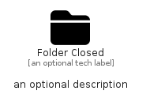

# FolderClosed


```text
fontawesome/Solid/FolderClosed
```

```text
include('fontawesome/Solid/FolderClosed')
```


| Illustration | FolderClosed |
| :---: | :---: |
|  |  |


## Sprites
The item provides the following sriptes:

- `<$FolderClosedXs>`
- `<$FolderClosedSm>`
- `<$FolderClosedMd>`
- `<$FolderClosedLg>`


## FolderClosed

### Load remotely
```plantuml
@startuml
' configures the library
!global $LIB_BASE_LOCATION="https://raw.githubusercontent.com/tmorin/plantuml-libs/master/distribution"

' loads the library's bootstrap
!include $LIB_BASE_LOCATION/bootstrap.puml

' loads the package bootstrap
include('fontawesome/bootstrap')

' loads the Item which embeds the element FolderClosed
include('fontawesome/Solid/FolderClosed')

' renders the element
FolderClosed('FolderClosed', 'Folder Closed', 'an optional tech label', 'an optional description')
@enduml
```

### Load locally
```plantuml
@startuml
' configures the library
!global $INCLUSION_MODE="local"
!global $LIB_BASE_LOCATION="../.."

' loads the library's bootstrap
!include $LIB_BASE_LOCATION/bootstrap.puml

' loads the package bootstrap
include('fontawesome/bootstrap')

' loads the Item which embeds the element FolderClosed
include('fontawesome/Solid/FolderClosed')

' renders the element
FolderClosed('FolderClosed', 'Folder Closed', 'an optional tech label', 'an optional description')
@enduml
```

