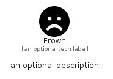

# Frown


```text
fontawesome/Solid/Frown
```

```text
include('fontawesome/Solid/Frown')
```


| Illustration | Frown |
| :---: | :---: |
|  |  |


## Sprites
The item provides the following sriptes:

- `<$FrownXs>`
- `<$FrownSm>`
- `<$FrownMd>`
- `<$FrownLg>`


## Frown

### Load remotely
```plantuml
@startuml
' configures the library
!global $LIB_BASE_LOCATION="https://raw.githubusercontent.com/tmorin/plantuml-libs/master/distribution"

' loads the library's bootstrap
!include $LIB_BASE_LOCATION/bootstrap.puml

' loads the package bootstrap
include('fontawesome/bootstrap')

' loads the Item which embeds the element Frown
include('fontawesome/Solid/Frown')

' renders the element
Frown('Frown', 'Frown', 'an optional tech label', 'an optional description')
@enduml
```

### Load locally
```plantuml
@startuml
' configures the library
!global $INCLUSION_MODE="local"
!global $LIB_BASE_LOCATION="../.."

' loads the library's bootstrap
!include $LIB_BASE_LOCATION/bootstrap.puml

' loads the package bootstrap
include('fontawesome/bootstrap')

' loads the Item which embeds the element Frown
include('fontawesome/Solid/Frown')

' renders the element
Frown('Frown', 'Frown', 'an optional tech label', 'an optional description')
@enduml
```

