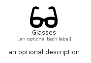

# Glasses


```text
fontawesome/Solid/Glasses
```

```text
include('fontawesome/Solid/Glasses')
```


| Illustration | Glasses |
| :---: | :---: |
|  |  |


## Sprites
The item provides the following sriptes:

- `<$GlassesXs>`
- `<$GlassesSm>`
- `<$GlassesMd>`
- `<$GlassesLg>`


## Glasses

### Load remotely
```plantuml
@startuml
' configures the library
!global $LIB_BASE_LOCATION="https://raw.githubusercontent.com/tmorin/plantuml-libs/master/distribution"

' loads the library's bootstrap
!include $LIB_BASE_LOCATION/bootstrap.puml

' loads the package bootstrap
include('fontawesome/bootstrap')

' loads the Item which embeds the element Glasses
include('fontawesome/Solid/Glasses')

' renders the element
Glasses('Glasses', 'Glasses', 'an optional tech label', 'an optional description')
@enduml
```

### Load locally
```plantuml
@startuml
' configures the library
!global $INCLUSION_MODE="local"
!global $LIB_BASE_LOCATION="../.."

' loads the library's bootstrap
!include $LIB_BASE_LOCATION/bootstrap.puml

' loads the package bootstrap
include('fontawesome/bootstrap')

' loads the Item which embeds the element Glasses
include('fontawesome/Solid/Glasses')

' renders the element
Glasses('Glasses', 'Glasses', 'an optional tech label', 'an optional description')
@enduml
```

