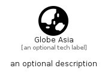

# GlobeAsia


```text
fontawesome/Solid/GlobeAsia
```

```text
include('fontawesome/Solid/GlobeAsia')
```


| Illustration | GlobeAsia |
| :---: | :---: |
|  |  |


## Sprites
The item provides the following sriptes:

- `<$GlobeAsiaXs>`
- `<$GlobeAsiaSm>`
- `<$GlobeAsiaMd>`
- `<$GlobeAsiaLg>`


## GlobeAsia

### Load remotely
```plantuml
@startuml
' configures the library
!global $LIB_BASE_LOCATION="https://raw.githubusercontent.com/tmorin/plantuml-libs/master/distribution"

' loads the library's bootstrap
!include $LIB_BASE_LOCATION/bootstrap.puml

' loads the package bootstrap
include('fontawesome/bootstrap')

' loads the Item which embeds the element GlobeAsia
include('fontawesome/Solid/GlobeAsia')

' renders the element
GlobeAsia('GlobeAsia', 'Globe Asia', 'an optional tech label', 'an optional description')
@enduml
```

### Load locally
```plantuml
@startuml
' configures the library
!global $INCLUSION_MODE="local"
!global $LIB_BASE_LOCATION="../.."

' loads the library's bootstrap
!include $LIB_BASE_LOCATION/bootstrap.puml

' loads the package bootstrap
include('fontawesome/bootstrap')

' loads the Item which embeds the element GlobeAsia
include('fontawesome/Solid/GlobeAsia')

' renders the element
GlobeAsia('GlobeAsia', 'Globe Asia', 'an optional tech label', 'an optional description')
@enduml
```

