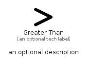

# GreaterThan


```text
fontawesome/Solid/GreaterThan
```

```text
include('fontawesome/Solid/GreaterThan')
```


| Illustration | GreaterThan |
| :---: | :---: |
|  |  |


## Sprites
The item provides the following sriptes:

- `<$GreaterThanXs>`
- `<$GreaterThanSm>`
- `<$GreaterThanMd>`
- `<$GreaterThanLg>`


## GreaterThan

### Load remotely
```plantuml
@startuml
' configures the library
!global $LIB_BASE_LOCATION="https://raw.githubusercontent.com/tmorin/plantuml-libs/master/distribution"

' loads the library's bootstrap
!include $LIB_BASE_LOCATION/bootstrap.puml

' loads the package bootstrap
include('fontawesome/bootstrap')

' loads the Item which embeds the element GreaterThan
include('fontawesome/Solid/GreaterThan')

' renders the element
GreaterThan('GreaterThan', 'Greater Than', 'an optional tech label', 'an optional description')
@enduml
```

### Load locally
```plantuml
@startuml
' configures the library
!global $INCLUSION_MODE="local"
!global $LIB_BASE_LOCATION="../.."

' loads the library's bootstrap
!include $LIB_BASE_LOCATION/bootstrap.puml

' loads the package bootstrap
include('fontawesome/bootstrap')

' loads the Item which embeds the element GreaterThan
include('fontawesome/Solid/GreaterThan')

' renders the element
GreaterThan('GreaterThan', 'Greater Than', 'an optional tech label', 'an optional description')
@enduml
```

