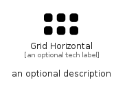

# GridHorizontal


```text
fontawesome/Solid/GridHorizontal
```

```text
include('fontawesome/Solid/GridHorizontal')
```


| Illustration | GridHorizontal |
| :---: | :---: |
|  |  |


## Sprites
The item provides the following sriptes:

- `<$GridHorizontalXs>`
- `<$GridHorizontalSm>`
- `<$GridHorizontalMd>`
- `<$GridHorizontalLg>`


## GridHorizontal

### Load remotely
```plantuml
@startuml
' configures the library
!global $LIB_BASE_LOCATION="https://raw.githubusercontent.com/tmorin/plantuml-libs/master/distribution"

' loads the library's bootstrap
!include $LIB_BASE_LOCATION/bootstrap.puml

' loads the package bootstrap
include('fontawesome/bootstrap')

' loads the Item which embeds the element GridHorizontal
include('fontawesome/Solid/GridHorizontal')

' renders the element
GridHorizontal('GridHorizontal', 'Grid Horizontal', 'an optional tech label', 'an optional description')
@enduml
```

### Load locally
```plantuml
@startuml
' configures the library
!global $INCLUSION_MODE="local"
!global $LIB_BASE_LOCATION="../.."

' loads the library's bootstrap
!include $LIB_BASE_LOCATION/bootstrap.puml

' loads the package bootstrap
include('fontawesome/bootstrap')

' loads the Item which embeds the element GridHorizontal
include('fontawesome/Solid/GridHorizontal')

' renders the element
GridHorizontal('GridHorizontal', 'Grid Horizontal', 'an optional tech label', 'an optional description')
@enduml
```

