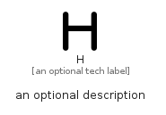

# H


```text
fontawesome/Solid/H
```

```text
include('fontawesome/Solid/H')
```


| Illustration | H |
| :---: | :---: |
|  |  |


## Sprites
The item provides the following sriptes:

- `<$HXs>`
- `<$HSm>`
- `<$HMd>`
- `<$HLg>`


## H

### Load remotely
```plantuml
@startuml
' configures the library
!global $LIB_BASE_LOCATION="https://raw.githubusercontent.com/tmorin/plantuml-libs/master/distribution"

' loads the library's bootstrap
!include $LIB_BASE_LOCATION/bootstrap.puml

' loads the package bootstrap
include('fontawesome/bootstrap')

' loads the Item which embeds the element H
include('fontawesome/Solid/H')

' renders the element
H('H', 'H', 'an optional tech label', 'an optional description')
@enduml
```

### Load locally
```plantuml
@startuml
' configures the library
!global $INCLUSION_MODE="local"
!global $LIB_BASE_LOCATION="../.."

' loads the library's bootstrap
!include $LIB_BASE_LOCATION/bootstrap.puml

' loads the package bootstrap
include('fontawesome/bootstrap')

' loads the Item which embeds the element H
include('fontawesome/Solid/H')

' renders the element
H('H', 'H', 'an optional tech label', 'an optional description')
@enduml
```

