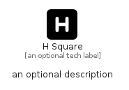

# HSquare


```text
fontawesome/Solid/HSquare
```

```text
include('fontawesome/Solid/HSquare')
```


| Illustration | HSquare |
| :---: | :---: |
|  |  |


## Sprites
The item provides the following sriptes:

- `<$HSquareXs>`
- `<$HSquareSm>`
- `<$HSquareMd>`
- `<$HSquareLg>`


## HSquare

### Load remotely
```plantuml
@startuml
' configures the library
!global $LIB_BASE_LOCATION="https://raw.githubusercontent.com/tmorin/plantuml-libs/master/distribution"

' loads the library's bootstrap
!include $LIB_BASE_LOCATION/bootstrap.puml

' loads the package bootstrap
include('fontawesome/bootstrap')

' loads the Item which embeds the element HSquare
include('fontawesome/Solid/HSquare')

' renders the element
HSquare('HSquare', 'H Square', 'an optional tech label', 'an optional description')
@enduml
```

### Load locally
```plantuml
@startuml
' configures the library
!global $INCLUSION_MODE="local"
!global $LIB_BASE_LOCATION="../.."

' loads the library's bootstrap
!include $LIB_BASE_LOCATION/bootstrap.puml

' loads the package bootstrap
include('fontawesome/bootstrap')

' loads the Item which embeds the element HSquare
include('fontawesome/Solid/HSquare')

' renders the element
HSquare('HSquare', 'H Square', 'an optional tech label', 'an optional description')
@enduml
```

