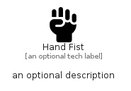

# HandFist


```text
fontawesome/Solid/HandFist
```

```text
include('fontawesome/Solid/HandFist')
```


| Illustration | HandFist |
| :---: | :---: |
|  |  |


## Sprites
The item provides the following sriptes:

- `<$HandFistXs>`
- `<$HandFistSm>`
- `<$HandFistMd>`
- `<$HandFistLg>`


## HandFist

### Load remotely
```plantuml
@startuml
' configures the library
!global $LIB_BASE_LOCATION="https://raw.githubusercontent.com/tmorin/plantuml-libs/master/distribution"

' loads the library's bootstrap
!include $LIB_BASE_LOCATION/bootstrap.puml

' loads the package bootstrap
include('fontawesome/bootstrap')

' loads the Item which embeds the element HandFist
include('fontawesome/Solid/HandFist')

' renders the element
HandFist('HandFist', 'Hand Fist', 'an optional tech label', 'an optional description')
@enduml
```

### Load locally
```plantuml
@startuml
' configures the library
!global $INCLUSION_MODE="local"
!global $LIB_BASE_LOCATION="../.."

' loads the library's bootstrap
!include $LIB_BASE_LOCATION/bootstrap.puml

' loads the package bootstrap
include('fontawesome/bootstrap')

' loads the Item which embeds the element HandFist
include('fontawesome/Solid/HandFist')

' renders the element
HandFist('HandFist', 'Hand Fist', 'an optional tech label', 'an optional description')
@enduml
```

