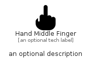

# HandMiddleFinger


```text
fontawesome/Solid/HandMiddleFinger
```

```text
include('fontawesome/Solid/HandMiddleFinger')
```


| Illustration | HandMiddleFinger |
| :---: | :---: |
|  |  |


## Sprites
The item provides the following sriptes:

- `<$HandMiddleFingerXs>`
- `<$HandMiddleFingerSm>`
- `<$HandMiddleFingerMd>`
- `<$HandMiddleFingerLg>`


## HandMiddleFinger

### Load remotely
```plantuml
@startuml
' configures the library
!global $LIB_BASE_LOCATION="https://raw.githubusercontent.com/tmorin/plantuml-libs/master/distribution"

' loads the library's bootstrap
!include $LIB_BASE_LOCATION/bootstrap.puml

' loads the package bootstrap
include('fontawesome/bootstrap')

' loads the Item which embeds the element HandMiddleFinger
include('fontawesome/Solid/HandMiddleFinger')

' renders the element
HandMiddleFinger('HandMiddleFinger', 'Hand Middle Finger', 'an optional tech label', 'an optional description')
@enduml
```

### Load locally
```plantuml
@startuml
' configures the library
!global $INCLUSION_MODE="local"
!global $LIB_BASE_LOCATION="../.."

' loads the library's bootstrap
!include $LIB_BASE_LOCATION/bootstrap.puml

' loads the package bootstrap
include('fontawesome/bootstrap')

' loads the Item which embeds the element HandMiddleFinger
include('fontawesome/Solid/HandMiddleFinger')

' renders the element
HandMiddleFinger('HandMiddleFinger', 'Hand Middle Finger', 'an optional tech label', 'an optional description')
@enduml
```

