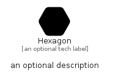

# Hexagon


```text
fontawesome/Solid/Hexagon
```

```text
include('fontawesome/Solid/Hexagon')
```


| Illustration | Hexagon |
| :---: | :---: |
|  |  |


## Sprites
The item provides the following sriptes:

- `<$HexagonXs>`
- `<$HexagonSm>`
- `<$HexagonMd>`
- `<$HexagonLg>`


## Hexagon

### Load remotely
```plantuml
@startuml
' configures the library
!global $LIB_BASE_LOCATION="https://raw.githubusercontent.com/tmorin/plantuml-libs/master/distribution"

' loads the library's bootstrap
!include $LIB_BASE_LOCATION/bootstrap.puml

' loads the package bootstrap
include('fontawesome/bootstrap')

' loads the Item which embeds the element Hexagon
include('fontawesome/Solid/Hexagon')

' renders the element
Hexagon('Hexagon', 'Hexagon', 'an optional tech label', 'an optional description')
@enduml
```

### Load locally
```plantuml
@startuml
' configures the library
!global $INCLUSION_MODE="local"
!global $LIB_BASE_LOCATION="../.."

' loads the library's bootstrap
!include $LIB_BASE_LOCATION/bootstrap.puml

' loads the package bootstrap
include('fontawesome/bootstrap')

' loads the Item which embeds the element Hexagon
include('fontawesome/Solid/Hexagon')

' renders the element
Hexagon('Hexagon', 'Hexagon', 'an optional tech label', 'an optional description')
@enduml
```

