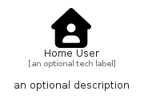

# HomeUser


```text
fontawesome/Solid/HomeUser
```

```text
include('fontawesome/Solid/HomeUser')
```


| Illustration | HomeUser |
| :---: | :---: |
|  |  |


## Sprites
The item provides the following sriptes:

- `<$HomeUserXs>`
- `<$HomeUserSm>`
- `<$HomeUserMd>`
- `<$HomeUserLg>`


## HomeUser

### Load remotely
```plantuml
@startuml
' configures the library
!global $LIB_BASE_LOCATION="https://raw.githubusercontent.com/tmorin/plantuml-libs/master/distribution"

' loads the library's bootstrap
!include $LIB_BASE_LOCATION/bootstrap.puml

' loads the package bootstrap
include('fontawesome/bootstrap')

' loads the Item which embeds the element HomeUser
include('fontawesome/Solid/HomeUser')

' renders the element
HomeUser('HomeUser', 'Home User', 'an optional tech label', 'an optional description')
@enduml
```

### Load locally
```plantuml
@startuml
' configures the library
!global $INCLUSION_MODE="local"
!global $LIB_BASE_LOCATION="../.."

' loads the library's bootstrap
!include $LIB_BASE_LOCATION/bootstrap.puml

' loads the package bootstrap
include('fontawesome/bootstrap')

' loads the Item which embeds the element HomeUser
include('fontawesome/Solid/HomeUser')

' renders the element
HomeUser('HomeUser', 'Home User', 'an optional tech label', 'an optional description')
@enduml
```

