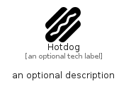

# Hotdog


```text
fontawesome/Solid/Hotdog
```

```text
include('fontawesome/Solid/Hotdog')
```


| Illustration | Hotdog |
| :---: | :---: |
|  |  |


## Sprites
The item provides the following sriptes:

- `<$HotdogXs>`
- `<$HotdogSm>`
- `<$HotdogMd>`
- `<$HotdogLg>`


## Hotdog

### Load remotely
```plantuml
@startuml
' configures the library
!global $LIB_BASE_LOCATION="https://raw.githubusercontent.com/tmorin/plantuml-libs/master/distribution"

' loads the library's bootstrap
!include $LIB_BASE_LOCATION/bootstrap.puml

' loads the package bootstrap
include('fontawesome/bootstrap')

' loads the Item which embeds the element Hotdog
include('fontawesome/Solid/Hotdog')

' renders the element
Hotdog('Hotdog', 'Hotdog', 'an optional tech label', 'an optional description')
@enduml
```

### Load locally
```plantuml
@startuml
' configures the library
!global $INCLUSION_MODE="local"
!global $LIB_BASE_LOCATION="../.."

' loads the library's bootstrap
!include $LIB_BASE_LOCATION/bootstrap.puml

' loads the package bootstrap
include('fontawesome/bootstrap')

' loads the Item which embeds the element Hotdog
include('fontawesome/Solid/Hotdog')

' renders the element
Hotdog('Hotdog', 'Hotdog', 'an optional tech label', 'an optional description')
@enduml
```

