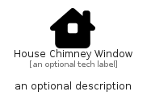

# HouseChimneyWindow


```text
fontawesome/Solid/HouseChimneyWindow
```

```text
include('fontawesome/Solid/HouseChimneyWindow')
```


| Illustration | HouseChimneyWindow |
| :---: | :---: |
|  |  |


## Sprites
The item provides the following sriptes:

- `<$HouseChimneyWindowXs>`
- `<$HouseChimneyWindowSm>`
- `<$HouseChimneyWindowMd>`
- `<$HouseChimneyWindowLg>`


## HouseChimneyWindow

### Load remotely
```plantuml
@startuml
' configures the library
!global $LIB_BASE_LOCATION="https://raw.githubusercontent.com/tmorin/plantuml-libs/master/distribution"

' loads the library's bootstrap
!include $LIB_BASE_LOCATION/bootstrap.puml

' loads the package bootstrap
include('fontawesome/bootstrap')

' loads the Item which embeds the element HouseChimneyWindow
include('fontawesome/Solid/HouseChimneyWindow')

' renders the element
HouseChimneyWindow('HouseChimneyWindow', 'House Chimney Window', 'an optional tech label', 'an optional description')
@enduml
```

### Load locally
```plantuml
@startuml
' configures the library
!global $INCLUSION_MODE="local"
!global $LIB_BASE_LOCATION="../.."

' loads the library's bootstrap
!include $LIB_BASE_LOCATION/bootstrap.puml

' loads the package bootstrap
include('fontawesome/bootstrap')

' loads the Item which embeds the element HouseChimneyWindow
include('fontawesome/Solid/HouseChimneyWindow')

' renders the element
HouseChimneyWindow('HouseChimneyWindow', 'House Chimney Window', 'an optional tech label', 'an optional description')
@enduml
```

