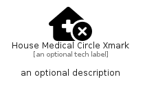

# HouseMedicalCircleXmark


```text
fontawesome/Solid/HouseMedicalCircleXmark
```

```text
include('fontawesome/Solid/HouseMedicalCircleXmark')
```


| Illustration | HouseMedicalCircleXmark |
| :---: | :---: |
|  |  |


## Sprites
The item provides the following sriptes:

- `<$HouseMedicalCircleXmarkXs>`
- `<$HouseMedicalCircleXmarkSm>`
- `<$HouseMedicalCircleXmarkMd>`
- `<$HouseMedicalCircleXmarkLg>`


## HouseMedicalCircleXmark

### Load remotely
```plantuml
@startuml
' configures the library
!global $LIB_BASE_LOCATION="https://raw.githubusercontent.com/tmorin/plantuml-libs/master/distribution"

' loads the library's bootstrap
!include $LIB_BASE_LOCATION/bootstrap.puml

' loads the package bootstrap
include('fontawesome/bootstrap')

' loads the Item which embeds the element HouseMedicalCircleXmark
include('fontawesome/Solid/HouseMedicalCircleXmark')

' renders the element
HouseMedicalCircleXmark('HouseMedicalCircleXmark', 'House Medical Circle Xmark', 'an optional tech label', 'an optional description')
@enduml
```

### Load locally
```plantuml
@startuml
' configures the library
!global $INCLUSION_MODE="local"
!global $LIB_BASE_LOCATION="../.."

' loads the library's bootstrap
!include $LIB_BASE_LOCATION/bootstrap.puml

' loads the package bootstrap
include('fontawesome/bootstrap')

' loads the Item which embeds the element HouseMedicalCircleXmark
include('fontawesome/Solid/HouseMedicalCircleXmark')

' renders the element
HouseMedicalCircleXmark('HouseMedicalCircleXmark', 'House Medical Circle Xmark', 'an optional tech label', 'an optional description')
@enduml
```

