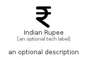

# IndianRupee


```text
fontawesome/Solid/IndianRupee
```

```text
include('fontawesome/Solid/IndianRupee')
```


| Illustration | IndianRupee |
| :---: | :---: |
|  |  |


## Sprites
The item provides the following sriptes:

- `<$IndianRupeeXs>`
- `<$IndianRupeeSm>`
- `<$IndianRupeeMd>`
- `<$IndianRupeeLg>`


## IndianRupee

### Load remotely
```plantuml
@startuml
' configures the library
!global $LIB_BASE_LOCATION="https://raw.githubusercontent.com/tmorin/plantuml-libs/master/distribution"

' loads the library's bootstrap
!include $LIB_BASE_LOCATION/bootstrap.puml

' loads the package bootstrap
include('fontawesome/bootstrap')

' loads the Item which embeds the element IndianRupee
include('fontawesome/Solid/IndianRupee')

' renders the element
IndianRupee('IndianRupee', 'Indian Rupee', 'an optional tech label', 'an optional description')
@enduml
```

### Load locally
```plantuml
@startuml
' configures the library
!global $INCLUSION_MODE="local"
!global $LIB_BASE_LOCATION="../.."

' loads the library's bootstrap
!include $LIB_BASE_LOCATION/bootstrap.puml

' loads the package bootstrap
include('fontawesome/bootstrap')

' loads the Item which embeds the element IndianRupee
include('fontawesome/Solid/IndianRupee')

' renders the element
IndianRupee('IndianRupee', 'Indian Rupee', 'an optional tech label', 'an optional description')
@enduml
```

