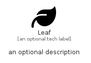

# Leaf


```text
fontawesome/Solid/Leaf
```

```text
include('fontawesome/Solid/Leaf')
```


| Illustration | Leaf |
| :---: | :---: |
|  |  |


## Sprites
The item provides the following sriptes:

- `<$LeafXs>`
- `<$LeafSm>`
- `<$LeafMd>`
- `<$LeafLg>`


## Leaf

### Load remotely
```plantuml
@startuml
' configures the library
!global $LIB_BASE_LOCATION="https://raw.githubusercontent.com/tmorin/plantuml-libs/master/distribution"

' loads the library's bootstrap
!include $LIB_BASE_LOCATION/bootstrap.puml

' loads the package bootstrap
include('fontawesome/bootstrap')

' loads the Item which embeds the element Leaf
include('fontawesome/Solid/Leaf')

' renders the element
Leaf('Leaf', 'Leaf', 'an optional tech label', 'an optional description')
@enduml
```

### Load locally
```plantuml
@startuml
' configures the library
!global $INCLUSION_MODE="local"
!global $LIB_BASE_LOCATION="../.."

' loads the library's bootstrap
!include $LIB_BASE_LOCATION/bootstrap.puml

' loads the package bootstrap
include('fontawesome/bootstrap')

' loads the Item which embeds the element Leaf
include('fontawesome/Solid/Leaf')

' renders the element
Leaf('Leaf', 'Leaf', 'an optional tech label', 'an optional description')
@enduml
```

