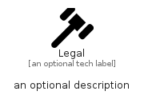

# Legal


```text
fontawesome/Solid/Legal
```

```text
include('fontawesome/Solid/Legal')
```


| Illustration | Legal |
| :---: | :---: |
|  |  |


## Sprites
The item provides the following sriptes:

- `<$LegalXs>`
- `<$LegalSm>`
- `<$LegalMd>`
- `<$LegalLg>`


## Legal

### Load remotely
```plantuml
@startuml
' configures the library
!global $LIB_BASE_LOCATION="https://raw.githubusercontent.com/tmorin/plantuml-libs/master/distribution"

' loads the library's bootstrap
!include $LIB_BASE_LOCATION/bootstrap.puml

' loads the package bootstrap
include('fontawesome/bootstrap')

' loads the Item which embeds the element Legal
include('fontawesome/Solid/Legal')

' renders the element
Legal('Legal', 'Legal', 'an optional tech label', 'an optional description')
@enduml
```

### Load locally
```plantuml
@startuml
' configures the library
!global $INCLUSION_MODE="local"
!global $LIB_BASE_LOCATION="../.."

' loads the library's bootstrap
!include $LIB_BASE_LOCATION/bootstrap.puml

' loads the package bootstrap
include('fontawesome/bootstrap')

' loads the Item which embeds the element Legal
include('fontawesome/Solid/Legal')

' renders the element
Legal('Legal', 'Legal', 'an optional tech label', 'an optional description')
@enduml
```

