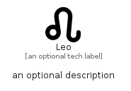

# Leo


```text
fontawesome/Solid/Leo
```

```text
include('fontawesome/Solid/Leo')
```


| Illustration | Leo |
| :---: | :---: |
|  |  |


## Sprites
The item provides the following sriptes:

- `<$LeoXs>`
- `<$LeoSm>`
- `<$LeoMd>`
- `<$LeoLg>`


## Leo

### Load remotely
```plantuml
@startuml
' configures the library
!global $LIB_BASE_LOCATION="https://raw.githubusercontent.com/tmorin/plantuml-libs/master/distribution"

' loads the library's bootstrap
!include $LIB_BASE_LOCATION/bootstrap.puml

' loads the package bootstrap
include('fontawesome/bootstrap')

' loads the Item which embeds the element Leo
include('fontawesome/Solid/Leo')

' renders the element
Leo('Leo', 'Leo', 'an optional tech label', 'an optional description')
@enduml
```

### Load locally
```plantuml
@startuml
' configures the library
!global $INCLUSION_MODE="local"
!global $LIB_BASE_LOCATION="../.."

' loads the library's bootstrap
!include $LIB_BASE_LOCATION/bootstrap.puml

' loads the package bootstrap
include('fontawesome/bootstrap')

' loads the Item which embeds the element Leo
include('fontawesome/Solid/Leo')

' renders the element
Leo('Leo', 'Leo', 'an optional tech label', 'an optional description')
@enduml
```

