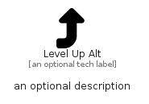

# LevelUpAlt


```text
fontawesome/Solid/LevelUpAlt
```

```text
include('fontawesome/Solid/LevelUpAlt')
```


| Illustration | LevelUpAlt |
| :---: | :---: |
|  |  |


## Sprites
The item provides the following sriptes:

- `<$LevelUpAltXs>`
- `<$LevelUpAltSm>`
- `<$LevelUpAltMd>`
- `<$LevelUpAltLg>`


## LevelUpAlt

### Load remotely
```plantuml
@startuml
' configures the library
!global $LIB_BASE_LOCATION="https://raw.githubusercontent.com/tmorin/plantuml-libs/master/distribution"

' loads the library's bootstrap
!include $LIB_BASE_LOCATION/bootstrap.puml

' loads the package bootstrap
include('fontawesome/bootstrap')

' loads the Item which embeds the element LevelUpAlt
include('fontawesome/Solid/LevelUpAlt')

' renders the element
LevelUpAlt('LevelUpAlt', 'Level Up Alt', 'an optional tech label', 'an optional description')
@enduml
```

### Load locally
```plantuml
@startuml
' configures the library
!global $INCLUSION_MODE="local"
!global $LIB_BASE_LOCATION="../.."

' loads the library's bootstrap
!include $LIB_BASE_LOCATION/bootstrap.puml

' loads the package bootstrap
include('fontawesome/bootstrap')

' loads the Item which embeds the element LevelUpAlt
include('fontawesome/Solid/LevelUpAlt')

' renders the element
LevelUpAlt('LevelUpAlt', 'Level Up Alt', 'an optional tech label', 'an optional description')
@enduml
```

