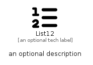

# List12


```text
fontawesome/Solid/List12
```

```text
include('fontawesome/Solid/List12')
```


| Illustration | List12 |
| :---: | :---: |
|  |  |


## Sprites
The item provides the following sriptes:

- `<$List12Xs>`
- `<$List12Sm>`
- `<$List12Md>`
- `<$List12Lg>`


## List12

### Load remotely
```plantuml
@startuml
' configures the library
!global $LIB_BASE_LOCATION="https://raw.githubusercontent.com/tmorin/plantuml-libs/master/distribution"

' loads the library's bootstrap
!include $LIB_BASE_LOCATION/bootstrap.puml

' loads the package bootstrap
include('fontawesome/bootstrap')

' loads the Item which embeds the element List12
include('fontawesome/Solid/List12')

' renders the element
List12('List12', 'List12', 'an optional tech label', 'an optional description')
@enduml
```

### Load locally
```plantuml
@startuml
' configures the library
!global $INCLUSION_MODE="local"
!global $LIB_BASE_LOCATION="../.."

' loads the library's bootstrap
!include $LIB_BASE_LOCATION/bootstrap.puml

' loads the package bootstrap
include('fontawesome/bootstrap')

' loads the Item which embeds the element List12
include('fontawesome/Solid/List12')

' renders the element
List12('List12', 'List12', 'an optional tech label', 'an optional description')
@enduml
```

