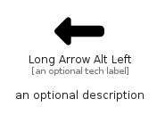

# LongArrowAltLeft


```text
fontawesome/Solid/LongArrowAltLeft
```

```text
include('fontawesome/Solid/LongArrowAltLeft')
```


| Illustration | LongArrowAltLeft |
| :---: | :---: |
|  |  |


## Sprites
The item provides the following sriptes:

- `<$LongArrowAltLeftXs>`
- `<$LongArrowAltLeftSm>`
- `<$LongArrowAltLeftMd>`
- `<$LongArrowAltLeftLg>`


## LongArrowAltLeft

### Load remotely
```plantuml
@startuml
' configures the library
!global $LIB_BASE_LOCATION="https://raw.githubusercontent.com/tmorin/plantuml-libs/master/distribution"

' loads the library's bootstrap
!include $LIB_BASE_LOCATION/bootstrap.puml

' loads the package bootstrap
include('fontawesome/bootstrap')

' loads the Item which embeds the element LongArrowAltLeft
include('fontawesome/Solid/LongArrowAltLeft')

' renders the element
LongArrowAltLeft('LongArrowAltLeft', 'Long Arrow Alt Left', 'an optional tech label', 'an optional description')
@enduml
```

### Load locally
```plantuml
@startuml
' configures the library
!global $INCLUSION_MODE="local"
!global $LIB_BASE_LOCATION="../.."

' loads the library's bootstrap
!include $LIB_BASE_LOCATION/bootstrap.puml

' loads the package bootstrap
include('fontawesome/bootstrap')

' loads the Item which embeds the element LongArrowAltLeft
include('fontawesome/Solid/LongArrowAltLeft')

' renders the element
LongArrowAltLeft('LongArrowAltLeft', 'Long Arrow Alt Left', 'an optional tech label', 'an optional description')
@enduml
```

