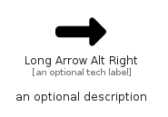

# LongArrowAltRight


```text
fontawesome/Solid/LongArrowAltRight
```

```text
include('fontawesome/Solid/LongArrowAltRight')
```


| Illustration | LongArrowAltRight |
| :---: | :---: |
|  |  |


## Sprites
The item provides the following sriptes:

- `<$LongArrowAltRightXs>`
- `<$LongArrowAltRightSm>`
- `<$LongArrowAltRightMd>`
- `<$LongArrowAltRightLg>`


## LongArrowAltRight

### Load remotely
```plantuml
@startuml
' configures the library
!global $LIB_BASE_LOCATION="https://raw.githubusercontent.com/tmorin/plantuml-libs/master/distribution"

' loads the library's bootstrap
!include $LIB_BASE_LOCATION/bootstrap.puml

' loads the package bootstrap
include('fontawesome/bootstrap')

' loads the Item which embeds the element LongArrowAltRight
include('fontawesome/Solid/LongArrowAltRight')

' renders the element
LongArrowAltRight('LongArrowAltRight', 'Long Arrow Alt Right', 'an optional tech label', 'an optional description')
@enduml
```

### Load locally
```plantuml
@startuml
' configures the library
!global $INCLUSION_MODE="local"
!global $LIB_BASE_LOCATION="../.."

' loads the library's bootstrap
!include $LIB_BASE_LOCATION/bootstrap.puml

' loads the package bootstrap
include('fontawesome/bootstrap')

' loads the Item which embeds the element LongArrowAltRight
include('fontawesome/Solid/LongArrowAltRight')

' renders the element
LongArrowAltRight('LongArrowAltRight', 'Long Arrow Alt Right', 'an optional tech label', 'an optional description')
@enduml
```

