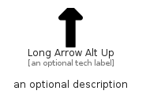

# LongArrowAltUp


```text
fontawesome/Solid/LongArrowAltUp
```

```text
include('fontawesome/Solid/LongArrowAltUp')
```


| Illustration | LongArrowAltUp |
| :---: | :---: |
|  |  |


## Sprites
The item provides the following sriptes:

- `<$LongArrowAltUpXs>`
- `<$LongArrowAltUpSm>`
- `<$LongArrowAltUpMd>`
- `<$LongArrowAltUpLg>`


## LongArrowAltUp

### Load remotely
```plantuml
@startuml
' configures the library
!global $LIB_BASE_LOCATION="https://raw.githubusercontent.com/tmorin/plantuml-libs/master/distribution"

' loads the library's bootstrap
!include $LIB_BASE_LOCATION/bootstrap.puml

' loads the package bootstrap
include('fontawesome/bootstrap')

' loads the Item which embeds the element LongArrowAltUp
include('fontawesome/Solid/LongArrowAltUp')

' renders the element
LongArrowAltUp('LongArrowAltUp', 'Long Arrow Alt Up', 'an optional tech label', 'an optional description')
@enduml
```

### Load locally
```plantuml
@startuml
' configures the library
!global $INCLUSION_MODE="local"
!global $LIB_BASE_LOCATION="../.."

' loads the library's bootstrap
!include $LIB_BASE_LOCATION/bootstrap.puml

' loads the package bootstrap
include('fontawesome/bootstrap')

' loads the Item which embeds the element LongArrowAltUp
include('fontawesome/Solid/LongArrowAltUp')

' renders the element
LongArrowAltUp('LongArrowAltUp', 'Long Arrow Alt Up', 'an optional tech label', 'an optional description')
@enduml
```

