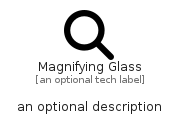

# MagnifyingGlass


```text
fontawesome/Solid/MagnifyingGlass
```

```text
include('fontawesome/Solid/MagnifyingGlass')
```


| Illustration | MagnifyingGlass |
| :---: | :---: |
|  |  |


## Sprites
The item provides the following sriptes:

- `<$MagnifyingGlassXs>`
- `<$MagnifyingGlassSm>`
- `<$MagnifyingGlassMd>`
- `<$MagnifyingGlassLg>`


## MagnifyingGlass

### Load remotely
```plantuml
@startuml
' configures the library
!global $LIB_BASE_LOCATION="https://raw.githubusercontent.com/tmorin/plantuml-libs/master/distribution"

' loads the library's bootstrap
!include $LIB_BASE_LOCATION/bootstrap.puml

' loads the package bootstrap
include('fontawesome/bootstrap')

' loads the Item which embeds the element MagnifyingGlass
include('fontawesome/Solid/MagnifyingGlass')

' renders the element
MagnifyingGlass('MagnifyingGlass', 'Magnifying Glass', 'an optional tech label', 'an optional description')
@enduml
```

### Load locally
```plantuml
@startuml
' configures the library
!global $INCLUSION_MODE="local"
!global $LIB_BASE_LOCATION="../.."

' loads the library's bootstrap
!include $LIB_BASE_LOCATION/bootstrap.puml

' loads the package bootstrap
include('fontawesome/bootstrap')

' loads the Item which embeds the element MagnifyingGlass
include('fontawesome/Solid/MagnifyingGlass')

' renders the element
MagnifyingGlass('MagnifyingGlass', 'Magnifying Glass', 'an optional tech label', 'an optional description')
@enduml
```

