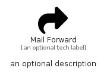

# MailForward


```text
fontawesome/Solid/MailForward
```

```text
include('fontawesome/Solid/MailForward')
```


| Illustration | MailForward |
| :---: | :---: |
|  |  |


## Sprites
The item provides the following sriptes:

- `<$MailForwardXs>`
- `<$MailForwardSm>`
- `<$MailForwardMd>`
- `<$MailForwardLg>`


## MailForward

### Load remotely
```plantuml
@startuml
' configures the library
!global $LIB_BASE_LOCATION="https://raw.githubusercontent.com/tmorin/plantuml-libs/master/distribution"

' loads the library's bootstrap
!include $LIB_BASE_LOCATION/bootstrap.puml

' loads the package bootstrap
include('fontawesome/bootstrap')

' loads the Item which embeds the element MailForward
include('fontawesome/Solid/MailForward')

' renders the element
MailForward('MailForward', 'Mail Forward', 'an optional tech label', 'an optional description')
@enduml
```

### Load locally
```plantuml
@startuml
' configures the library
!global $INCLUSION_MODE="local"
!global $LIB_BASE_LOCATION="../.."

' loads the library's bootstrap
!include $LIB_BASE_LOCATION/bootstrap.puml

' loads the package bootstrap
include('fontawesome/bootstrap')

' loads the Item which embeds the element MailForward
include('fontawesome/Solid/MailForward')

' renders the element
MailForward('MailForward', 'Mail Forward', 'an optional tech label', 'an optional description')
@enduml
```

