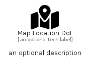

# MapLocationDot


```text
fontawesome/Solid/MapLocationDot
```

```text
include('fontawesome/Solid/MapLocationDot')
```


| Illustration | MapLocationDot |
| :---: | :---: |
|  |  |


## Sprites
The item provides the following sriptes:

- `<$MapLocationDotXs>`
- `<$MapLocationDotSm>`
- `<$MapLocationDotMd>`
- `<$MapLocationDotLg>`


## MapLocationDot

### Load remotely
```plantuml
@startuml
' configures the library
!global $LIB_BASE_LOCATION="https://raw.githubusercontent.com/tmorin/plantuml-libs/master/distribution"

' loads the library's bootstrap
!include $LIB_BASE_LOCATION/bootstrap.puml

' loads the package bootstrap
include('fontawesome/bootstrap')

' loads the Item which embeds the element MapLocationDot
include('fontawesome/Solid/MapLocationDot')

' renders the element
MapLocationDot('MapLocationDot', 'Map Location Dot', 'an optional tech label', 'an optional description')
@enduml
```

### Load locally
```plantuml
@startuml
' configures the library
!global $INCLUSION_MODE="local"
!global $LIB_BASE_LOCATION="../.."

' loads the library's bootstrap
!include $LIB_BASE_LOCATION/bootstrap.puml

' loads the package bootstrap
include('fontawesome/bootstrap')

' loads the Item which embeds the element MapLocationDot
include('fontawesome/Solid/MapLocationDot')

' renders the element
MapLocationDot('MapLocationDot', 'Map Location Dot', 'an optional tech label', 'an optional description')
@enduml
```

