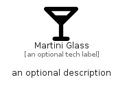

# MartiniGlass


```text
fontawesome/Solid/MartiniGlass
```

```text
include('fontawesome/Solid/MartiniGlass')
```


| Illustration | MartiniGlass |
| :---: | :---: |
|  |  |


## Sprites
The item provides the following sriptes:

- `<$MartiniGlassXs>`
- `<$MartiniGlassSm>`
- `<$MartiniGlassMd>`
- `<$MartiniGlassLg>`


## MartiniGlass

### Load remotely
```plantuml
@startuml
' configures the library
!global $LIB_BASE_LOCATION="https://raw.githubusercontent.com/tmorin/plantuml-libs/master/distribution"

' loads the library's bootstrap
!include $LIB_BASE_LOCATION/bootstrap.puml

' loads the package bootstrap
include('fontawesome/bootstrap')

' loads the Item which embeds the element MartiniGlass
include('fontawesome/Solid/MartiniGlass')

' renders the element
MartiniGlass('MartiniGlass', 'Martini Glass', 'an optional tech label', 'an optional description')
@enduml
```

### Load locally
```plantuml
@startuml
' configures the library
!global $INCLUSION_MODE="local"
!global $LIB_BASE_LOCATION="../.."

' loads the library's bootstrap
!include $LIB_BASE_LOCATION/bootstrap.puml

' loads the package bootstrap
include('fontawesome/bootstrap')

' loads the Item which embeds the element MartiniGlass
include('fontawesome/Solid/MartiniGlass')

' renders the element
MartiniGlass('MartiniGlass', 'Martini Glass', 'an optional tech label', 'an optional description')
@enduml
```

