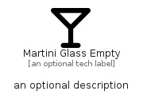

# MartiniGlassEmpty


```text
fontawesome/Solid/MartiniGlassEmpty
```

```text
include('fontawesome/Solid/MartiniGlassEmpty')
```


| Illustration | MartiniGlassEmpty |
| :---: | :---: |
|  |  |


## Sprites
The item provides the following sriptes:

- `<$MartiniGlassEmptyXs>`
- `<$MartiniGlassEmptySm>`
- `<$MartiniGlassEmptyMd>`
- `<$MartiniGlassEmptyLg>`


## MartiniGlassEmpty

### Load remotely
```plantuml
@startuml
' configures the library
!global $LIB_BASE_LOCATION="https://raw.githubusercontent.com/tmorin/plantuml-libs/master/distribution"

' loads the library's bootstrap
!include $LIB_BASE_LOCATION/bootstrap.puml

' loads the package bootstrap
include('fontawesome/bootstrap')

' loads the Item which embeds the element MartiniGlassEmpty
include('fontawesome/Solid/MartiniGlassEmpty')

' renders the element
MartiniGlassEmpty('MartiniGlassEmpty', 'Martini Glass Empty', 'an optional tech label', 'an optional description')
@enduml
```

### Load locally
```plantuml
@startuml
' configures the library
!global $INCLUSION_MODE="local"
!global $LIB_BASE_LOCATION="../.."

' loads the library's bootstrap
!include $LIB_BASE_LOCATION/bootstrap.puml

' loads the package bootstrap
include('fontawesome/bootstrap')

' loads the Item which embeds the element MartiniGlassEmpty
include('fontawesome/Solid/MartiniGlassEmpty')

' renders the element
MartiniGlassEmpty('MartiniGlassEmpty', 'Martini Glass Empty', 'an optional tech label', 'an optional description')
@enduml
```

