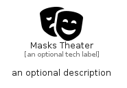

# MasksTheater


```text
fontawesome/Solid/MasksTheater
```

```text
include('fontawesome/Solid/MasksTheater')
```


| Illustration | MasksTheater |
| :---: | :---: |
|  |  |


## Sprites
The item provides the following sriptes:

- `<$MasksTheaterXs>`
- `<$MasksTheaterSm>`
- `<$MasksTheaterMd>`
- `<$MasksTheaterLg>`


## MasksTheater

### Load remotely
```plantuml
@startuml
' configures the library
!global $LIB_BASE_LOCATION="https://raw.githubusercontent.com/tmorin/plantuml-libs/master/distribution"

' loads the library's bootstrap
!include $LIB_BASE_LOCATION/bootstrap.puml

' loads the package bootstrap
include('fontawesome/bootstrap')

' loads the Item which embeds the element MasksTheater
include('fontawesome/Solid/MasksTheater')

' renders the element
MasksTheater('MasksTheater', 'Masks Theater', 'an optional tech label', 'an optional description')
@enduml
```

### Load locally
```plantuml
@startuml
' configures the library
!global $INCLUSION_MODE="local"
!global $LIB_BASE_LOCATION="../.."

' loads the library's bootstrap
!include $LIB_BASE_LOCATION/bootstrap.puml

' loads the package bootstrap
include('fontawesome/bootstrap')

' loads the Item which embeds the element MasksTheater
include('fontawesome/Solid/MasksTheater')

' renders the element
MasksTheater('MasksTheater', 'Masks Theater', 'an optional tech label', 'an optional description')
@enduml
```

