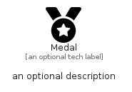

# Medal


```text
fontawesome/Solid/Medal
```

```text
include('fontawesome/Solid/Medal')
```


| Illustration | Medal |
| :---: | :---: |
|  |  |


## Sprites
The item provides the following sriptes:

- `<$MedalXs>`
- `<$MedalSm>`
- `<$MedalMd>`
- `<$MedalLg>`


## Medal

### Load remotely
```plantuml
@startuml
' configures the library
!global $LIB_BASE_LOCATION="https://raw.githubusercontent.com/tmorin/plantuml-libs/master/distribution"

' loads the library's bootstrap
!include $LIB_BASE_LOCATION/bootstrap.puml

' loads the package bootstrap
include('fontawesome/bootstrap')

' loads the Item which embeds the element Medal
include('fontawesome/Solid/Medal')

' renders the element
Medal('Medal', 'Medal', 'an optional tech label', 'an optional description')
@enduml
```

### Load locally
```plantuml
@startuml
' configures the library
!global $INCLUSION_MODE="local"
!global $LIB_BASE_LOCATION="../.."

' loads the library's bootstrap
!include $LIB_BASE_LOCATION/bootstrap.puml

' loads the package bootstrap
include('fontawesome/bootstrap')

' loads the Item which embeds the element Medal
include('fontawesome/Solid/Medal')

' renders the element
Medal('Medal', 'Medal', 'an optional tech label', 'an optional description')
@enduml
```

