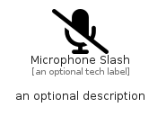

# MicrophoneSlash


```text
fontawesome/Solid/MicrophoneSlash
```

```text
include('fontawesome/Solid/MicrophoneSlash')
```


| Illustration | MicrophoneSlash |
| :---: | :---: |
|  |  |


## Sprites
The item provides the following sriptes:

- `<$MicrophoneSlashXs>`
- `<$MicrophoneSlashSm>`
- `<$MicrophoneSlashMd>`
- `<$MicrophoneSlashLg>`


## MicrophoneSlash

### Load remotely
```plantuml
@startuml
' configures the library
!global $LIB_BASE_LOCATION="https://raw.githubusercontent.com/tmorin/plantuml-libs/master/distribution"

' loads the library's bootstrap
!include $LIB_BASE_LOCATION/bootstrap.puml

' loads the package bootstrap
include('fontawesome/bootstrap')

' loads the Item which embeds the element MicrophoneSlash
include('fontawesome/Solid/MicrophoneSlash')

' renders the element
MicrophoneSlash('MicrophoneSlash', 'Microphone Slash', 'an optional tech label', 'an optional description')
@enduml
```

### Load locally
```plantuml
@startuml
' configures the library
!global $INCLUSION_MODE="local"
!global $LIB_BASE_LOCATION="../.."

' loads the library's bootstrap
!include $LIB_BASE_LOCATION/bootstrap.puml

' loads the package bootstrap
include('fontawesome/bootstrap')

' loads the Item which embeds the element MicrophoneSlash
include('fontawesome/Solid/MicrophoneSlash')

' renders the element
MicrophoneSlash('MicrophoneSlash', 'Microphone Slash', 'an optional tech label', 'an optional description')
@enduml
```

