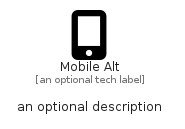

# MobileAlt


```text
fontawesome/Solid/MobileAlt
```

```text
include('fontawesome/Solid/MobileAlt')
```


| Illustration | MobileAlt |
| :---: | :---: |
|  |  |


## Sprites
The item provides the following sriptes:

- `<$MobileAltXs>`
- `<$MobileAltSm>`
- `<$MobileAltMd>`
- `<$MobileAltLg>`


## MobileAlt

### Load remotely
```plantuml
@startuml
' configures the library
!global $LIB_BASE_LOCATION="https://raw.githubusercontent.com/tmorin/plantuml-libs/master/distribution"

' loads the library's bootstrap
!include $LIB_BASE_LOCATION/bootstrap.puml

' loads the package bootstrap
include('fontawesome/bootstrap')

' loads the Item which embeds the element MobileAlt
include('fontawesome/Solid/MobileAlt')

' renders the element
MobileAlt('MobileAlt', 'Mobile Alt', 'an optional tech label', 'an optional description')
@enduml
```

### Load locally
```plantuml
@startuml
' configures the library
!global $INCLUSION_MODE="local"
!global $LIB_BASE_LOCATION="../.."

' loads the library's bootstrap
!include $LIB_BASE_LOCATION/bootstrap.puml

' loads the package bootstrap
include('fontawesome/bootstrap')

' loads the Item which embeds the element MobileAlt
include('fontawesome/Solid/MobileAlt')

' renders the element
MobileAlt('MobileAlt', 'Mobile Alt', 'an optional tech label', 'an optional description')
@enduml
```

