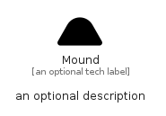

# Mound


```text
fontawesome/Solid/Mound
```

```text
include('fontawesome/Solid/Mound')
```


| Illustration | Mound |
| :---: | :---: |
|  |  |


## Sprites
The item provides the following sriptes:

- `<$MoundXs>`
- `<$MoundSm>`
- `<$MoundMd>`
- `<$MoundLg>`


## Mound

### Load remotely
```plantuml
@startuml
' configures the library
!global $LIB_BASE_LOCATION="https://raw.githubusercontent.com/tmorin/plantuml-libs/master/distribution"

' loads the library's bootstrap
!include $LIB_BASE_LOCATION/bootstrap.puml

' loads the package bootstrap
include('fontawesome/bootstrap')

' loads the Item which embeds the element Mound
include('fontawesome/Solid/Mound')

' renders the element
Mound('Mound', 'Mound', 'an optional tech label', 'an optional description')
@enduml
```

### Load locally
```plantuml
@startuml
' configures the library
!global $INCLUSION_MODE="local"
!global $LIB_BASE_LOCATION="../.."

' loads the library's bootstrap
!include $LIB_BASE_LOCATION/bootstrap.puml

' loads the package bootstrap
include('fontawesome/bootstrap')

' loads the Item which embeds the element Mound
include('fontawesome/Solid/Mound')

' renders the element
Mound('Mound', 'Mound', 'an optional tech label', 'an optional description')
@enduml
```

