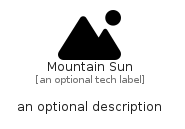

# MountainSun


```text
fontawesome/Solid/MountainSun
```

```text
include('fontawesome/Solid/MountainSun')
```


| Illustration | MountainSun |
| :---: | :---: |
|  |  |


## Sprites
The item provides the following sriptes:

- `<$MountainSunXs>`
- `<$MountainSunSm>`
- `<$MountainSunMd>`
- `<$MountainSunLg>`


## MountainSun

### Load remotely
```plantuml
@startuml
' configures the library
!global $LIB_BASE_LOCATION="https://raw.githubusercontent.com/tmorin/plantuml-libs/master/distribution"

' loads the library's bootstrap
!include $LIB_BASE_LOCATION/bootstrap.puml

' loads the package bootstrap
include('fontawesome/bootstrap')

' loads the Item which embeds the element MountainSun
include('fontawesome/Solid/MountainSun')

' renders the element
MountainSun('MountainSun', 'Mountain Sun', 'an optional tech label', 'an optional description')
@enduml
```

### Load locally
```plantuml
@startuml
' configures the library
!global $INCLUSION_MODE="local"
!global $LIB_BASE_LOCATION="../.."

' loads the library's bootstrap
!include $LIB_BASE_LOCATION/bootstrap.puml

' loads the package bootstrap
include('fontawesome/bootstrap')

' loads the Item which embeds the element MountainSun
include('fontawesome/Solid/MountainSun')

' renders the element
MountainSun('MountainSun', 'Mountain Sun', 'an optional tech label', 'an optional description')
@enduml
```

