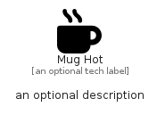

# MugHot


```text
fontawesome/Solid/MugHot
```

```text
include('fontawesome/Solid/MugHot')
```


| Illustration | MugHot |
| :---: | :---: |
|  |  |


## Sprites
The item provides the following sriptes:

- `<$MugHotXs>`
- `<$MugHotSm>`
- `<$MugHotMd>`
- `<$MugHotLg>`


## MugHot

### Load remotely
```plantuml
@startuml
' configures the library
!global $LIB_BASE_LOCATION="https://raw.githubusercontent.com/tmorin/plantuml-libs/master/distribution"

' loads the library's bootstrap
!include $LIB_BASE_LOCATION/bootstrap.puml

' loads the package bootstrap
include('fontawesome/bootstrap')

' loads the Item which embeds the element MugHot
include('fontawesome/Solid/MugHot')

' renders the element
MugHot('MugHot', 'Mug Hot', 'an optional tech label', 'an optional description')
@enduml
```

### Load locally
```plantuml
@startuml
' configures the library
!global $INCLUSION_MODE="local"
!global $LIB_BASE_LOCATION="../.."

' loads the library's bootstrap
!include $LIB_BASE_LOCATION/bootstrap.puml

' loads the package bootstrap
include('fontawesome/bootstrap')

' loads the Item which embeds the element MugHot
include('fontawesome/Solid/MugHot')

' renders the element
MugHot('MugHot', 'Mug Hot', 'an optional tech label', 'an optional description')
@enduml
```

